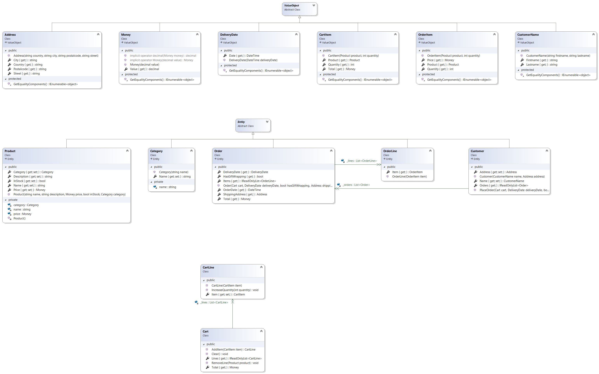

# Chapter 7 - Exercise 1
##  Objectives
- Learn how to create a Domain class library using the **D**omain **D**riven **D**esign Pattern
- Learn how to create a Xunit test project
- Learn how to write valueable tests
- Learn how to use Bogus to fake your test data
- Learn how to use value objects
- Learn how to use a static constructor
- Learn how to use entities
- Learn how to use **D**ata **T**ransfer **O**bjects
- Learn how to use Swagger
- Learn how to setup a REST API

## Goal 
In this exercise we are going to create a e-commerce website where customers can see products, add them to their cart and order them. However we'll be focussing on the domain and REST API. In the next chapter we'll implement the **U**ser **I**nterface using Blazor Web Assembly(WASM).

## Exercise
### Part 1 - Implementing the Domain
- Read the following official Microsoft documentation about [Value Objects](https://docs.microsoft.com/en-us/dotnet/architecture/microservices/microservice-ddd-cqrs-patterns/implement-value-objects).
- Read the following post from Vladimir Khorikov how to use the [Entity base class](https://enterprisecraftsmanship.com/posts/entity-base-class/).
- Create a new class library called Domain in a `src` folder.
- Create a new xunit project called Domain.Tests in a `tests` folder.
- Implement the following domain, initially model the domain, afterwards use the [domain rules](#domain-rules) to implement it correctly.

- During implementation you can write unit tests as you see fit. You can use [Shouldly](https://github.com/shouldly/shouldly) which makes it easier to assert certain tests, read more about it in the docs. Since creating dummy objects for tests can be quite tedious, you can use [Bogus](https://github.com/bchavez/Bogus) to create Fake generators. [Below](#faker-examples) you'll find some fakers, you can read more about them in the official documentation of [Bogus](https://github.com/bchavez/Bogus#using-fakert-inheritance):

### Part 2 - Implementing the Service Layer
- Create a new classlibrary called `Services` in the `src` folder.
- Create a new classlibrary called `Shared` in the `src` folder.
- In the `Shared` Project:
    - Create a folder called `Products`
    - Implement `Index` and `Detail` ProductDto in the `Shared/Products` folder:
    - `Index`:
        - Id : int
        - Name : string
        - InStock : bool
        - Price : decimal
    - `Detail`:
        - All fields from `Index`
        - Description : string
        - Category : string
    - Declare a `IProductService` interface with 3 methods in the Shared/Products folder
    ```cs
    public interface IProductService
    {
        Task<IEnumerable<ProductDto.Index>> GetIndexAsync();
        Task<ProductDto.Detail> GetDetailAsync(int id);
        Task DeleteAsync(int id);
    }
    ```
- In the `Services` Project:
    - Create a folder called `Products`
    - Add a reference to the `Shared` and the `Domain` project
    - Implement a `ProductService` which implements `IProductService` and make it return fake data, using Bogus, the Fakers you created for the unittests (mapped to DTO's) or sinmply fake data (for now). In a later chapter we'll use Entity Framework to fetch and mutate data in a Database. 
        - Use a static constructor to generate a static private list of `ProductDto.Detail`
        - GetIndex returns a list of 10 items
        - GetDetail returns 1 specific product based on the productId
        - Delete, deletes one product of the in-memory static list of products

### Part 3 - Implementing the REST API
- Create a new web api called `Api` in the `src` folder, make sure that OpenAPI is present. Use Visual Studio or the dotnet CLI to generate the project.
- Remove the following files:
    - `WeatherForecastController`
    - `WeatherForecast`
- Add a reference to the `Shared` and `Services` project
- Add `IProductService` to the dependency injection container in `Startup.cs` with an implementation of `ProductService` as `Scoped`
- Create a `ProductController`, which takes a IProductService in his constructor and has the following three methods:
    - `Task<IEnumerable<ProductDto.Index>> GetIndexAsync()` with endpoint: `/product`
    - `Task<ProductDto.Detail> GetDetailAsync(int id)` with endpoint `/product/{id}`
    - `Task DeleteAsync(int id)` with endpoint `/product/{id}` but as a delete
    - Use all 3 methods from the `IProductService` as implementation
    - Use the correct HTTP verb and attribute.
- To use full name of the DTO, which else will collide with other DTO subclasses later, alter the configuration of Swagger as follows:
    ```
    services.AddSwaggerGen(c =>
    {
        c.CustomSchemaIds(x => $"{x.DeclaringType.Name}.{x.Name}");
        c.SwaggerDoc("v1", new OpenApiInfo { Title = "Api", Version = "v1" });
    });
    ```

### Part 4 - Extending the API to support creation of Products
- Add [FluentValidation](https://fluentvalidation.net/) to the `Shared` project
- Create a nested class in `ProductDto` called `Create`:
    ```
    public class Create
    {
        public string Name { get; set; }
        public bool InStock { get; set; }
        public decimal Price { get; set; }
        public string Description { get; set; }
        public string Category { get; set; }

        public class Validator : AbstractValidator<Create>
        {
            public Validator()
            {
                RuleFor(x => x.Name).NotEmpty().Length(1,250);
                RuleFor(x => x.Price).InclusiveBetween(1,250);
                RuleFor(x => x.Category).NotEmpty().Length(1, 250);
            }
        }
    }
    ```
- Extend the `IProductService` with a `CreateAsync` function that takes in a `ProductDto.Create` as a parameter and returns an integer. Implement the function in `ProductService` so that we can add a product to the list of products.
- Create a HttpPost endpoint in the `ProductController` which takes in the `ProductDto.Create` and returns a `Task<ActionResult<int>>`, by returning a `CreatedAtAction` with the newly generated Id of the new `product`.
- Add FluentValidation Middleware to validate the Create request automagically, you can read more [here](https://docs.fluentvalidation.net/en/latest/aspnet.html#asp-net-core)
    - Add the NuGet package: `FluentValidation.AspNetCore`
    ```
    // In Startup.cs extend the .AddControllers function as follows:
    services.AddControllers().AddFluentValidation(fv => fv.RegisterValidatorsFromAssemblyContaining<ProductDto.Create.Validator>());
    ```

### Part 5 - Finished
Try running your API and using Swagger to make requests, try to create a new product, the validation middleware will kick in if needed.

## Domain Rules
### Address
- Non of the properties can be empty or null
- Addresses are equal when all the fields are equal.

### Money
- Non of the properties can be empty or null
- Money is equal when the value is equal to 2 digits after the comma.
- Has 2 implicit operators to cast from and to decimal, more information about implicit operators can be found in [this StackOverflow post](https://stackoverflow.com/questions/4273743/static-implicit-operator)

### DeliveryDate
- Non of the properties can be empty or null
- The date itself can only be created when it's between tomorrow and 1 month
- DeliveryDates are equal when all the fields are equal, comparing date without time.


### CartItem
- Product has to be filled-in
- Quantity cannot be negative
- Total is the product price times the quantity
- CartItems are equal when the products are the same.

### OrderItem
- Product has to be filled-in
- Quantity cannot be negative
- Total is the price times the quantity
- The price property is filled-in by the product price. When the product price is altered, the price or the OrderItem should not change.
- OrderItems are equal when the product, quantity and price are the same.

### CustomerName
- Non of the properties can be empty or null
- CustomerName's are equal when the firstname and lastname are the same. (ignore case)

---

### Product
- Name cannot be null or whitespace (use the private setter)
- Category cannot be null (use the private setter)
- Description can be anything your heart desires
- Price cannot be null (use the private setter)
- InStock has no real checks.
- Product is an entity thus, should be equal when the Id's are the same.

### Customer
- Name is mandatory
- Address is mandatory
- PlaceOrder adds a new order to the private collection
- Customer is an entity thus, should be equal when the Id's are the same.

### Category
- Name cannot be null or whitespace (use the private setter)
- Category is an entity thus, should be equal when the Id's are the same.

### Order
- OrderDate should be set to the current DateTime (use UTC)
- Cart should not be null
- Cart should contain more than 0 lines
- There are no checks on the deliverydate nor giftwrapping
- When created, it should be immutable, and adds all CartLine's as orderlines to the private collection and clears the Cart.
- Order is an entity thus, should be equal when the Id's are the same.

### OrderLine
- Is immutable and requires an OrderItem
- OrderLine is an entity thus, should be equal when the Id's are the same.

### Cart
- Can be created without any specific properties
- Total sums ip the item's totals.
- AddItem should add an item to list of it's not in the list yet(check the product) else it should increase the quantity of the item. 
RemoveLine, removes the line from the private collection.
- Clear, removes all items from the Cart.

### OrderLine
- Is immutable and requires an OrderItem
- IncreaseQuantity adds the quantity

## Faker Examples   
**Category Faker**
```cs
public class CategoryFaker : Faker<Category>
{
    public CategoryFaker()
    {
        CustomInstantiator(f => new Category(f.Commerce.ProductMaterial()));
        RuleFor(x => x.Id, f => f.Random.Int());
    }
}
```
**Address Faker**
```cs
public class AddressFaker : Faker<Address>
{
    public AddressFaker()
    {
        var a = new Bogus.DataSets.Address();
        CustomInstantiator(f => new Address(a.Country(), a.City(), a.ZipCode(), a.StreetAddress()));
    }
}
```
**Product Faker**
```cs
public class ProductFaker : Faker<Product>
{
    public ProductFaker()
    {
        CustomInstantiator(f => new Product(f.Commerce.ProductName(), f.Commerce.ProductDescription(), new Money(f.Random.Decimal(0, 200)), f.Random.Bool(), new CategoryFaker()));
        RuleFor(x => x.Id, f => f.Random.Int());
    }
}
```
**Example Customer Test**
```cs
[Fact]
public void Not_Be_Able_To_Order_When_Cart_Is_Empty()
{
    Customer customer = new CustomerFaker();
    Cart cart = new();
    DeliveryDate deliveryDate = new(DateTime.UtcNow.AddDays(2));

    Should.Throw<Exception>(() =>
    {
        customer.PlaceOrder(cart, deliveryDate, true, customer.Address);
    });
}
```


## Solution
A possible solution can be found [here](https://github.com/HOGENT-Web/csharp-ch-7-exercise-1/tree/solution#solution).